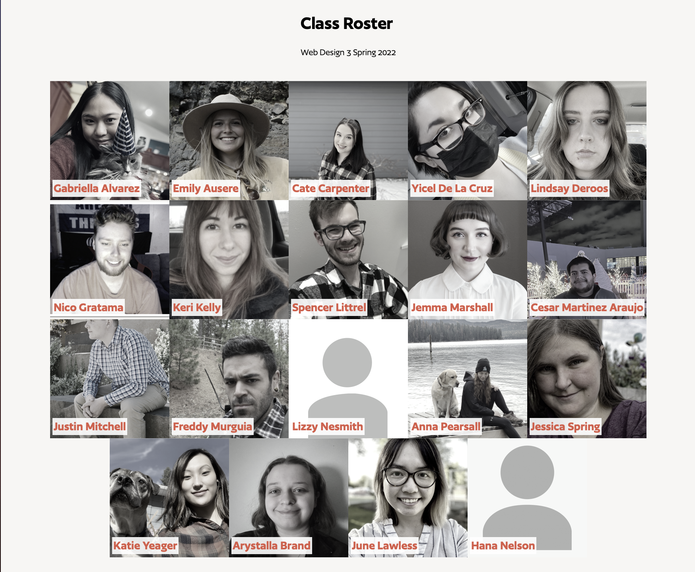

# Class Roster via our API data

[Class Roster](https://web3-class-roster.netlify.app)

## What Is This?

Get, Show, and Style a Class Roster via our API data

- Dynamically list content from an API data source
- Seperate the data from the design
- Use JS template literals for templating
- `fetch` a JSON data endpoint from Webflow
- Apply foundations of a _headless CMS_

## API Endpoint

Here is link to the API endpoint for the _Collection_ for roster Spring 2022 Students.
https://v1.nocodeapi.com/pmanikoth/webflow/wtzODovSIJsRXhZg

## Sources

[Inspired by](https://codemyui.com/wp-content/uploads/2021/05/Grayscale-To-Colour-Animation-On-Hover-For-Team-Section.mp4)

[Author font via Font Share](https://www.fontshare.com/fonts/author)

